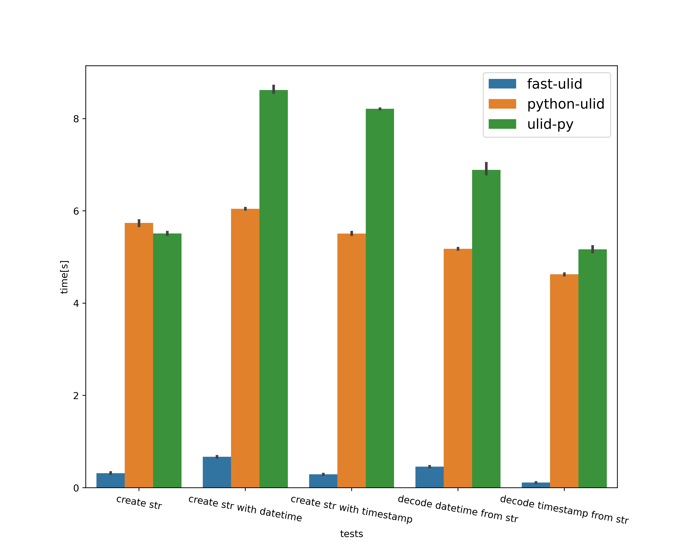

<h1 align="center">
	<br>
	<br>
	
	<br>
	<br>
	<br>
</h1>

# What is ULID?
[ULID](https://github.com/ulid/spec) is 

- URL safe
- Lexicographically sortable
- Monotonic sortable

ULIDs have been developed to replace UUIDs.

# What is fast-ulid?
It is Really fast Python implementation of ULID.\
Please see benchmark below.

# Installation

    $ pip install fast-ulid

should install the package.

# Usage

```python
import fast_ulid
import time
import datetime

# ulid.ulid() to create a new ULID with current timestamp
ulid = fast_ulid.ulid()

# or, you can create one with timestamp or datetime
# Note that the millisecond part of timestamp comes in the decimal part. 
# In other languages, the milliseconds may be placed in the integer part.
ulid = fast_ulid.ulid(datetime.datetime.now())
ulid = fast_ulid.ulid(time.time())

print(ulid)
# 01FVY4F1TYP63XM1YVHBVVCBSB

# and you can decode timestamp or datetime.datetime from ULID
print(fast_ulid.decode_timestamp(ulid))
# 1644910053.214
print(fast_ulid.decode_datetime(ulid))
# 2022-02-15 07:27:33.214000+00:00
```

# Benchmark
There are some other ULID implementations, but they are not as fast as fast-ulid.

I have benchmarked some functions that seem to be used frequently.\
And here is the result.



Tested other packages are below.

- [python-ulid](https://github.com/mdomke/python-ulid) by [mdomke](https://github.com/mdomke)
- [ulid-py](https://github.com/ahawker/ulid) by [ahawker](https://github.com/ahawker)

There is also an implementation of [ulid](https://github.com/mdipierro/ulid) by [mdipierro](https://github.com/mdipierro), but it is about 20-50 times slower and does not provide functions to parse or create ulids from specific timestamps.\
Therefore, I excluded it from the benchmark.

# Why fast-ulid?

Because it's fast! Other Python ULID implementations are written in Python, so they are (relatively) slow.\
fast-ulid is written in C, so it's fast.

> however, those implementations are highly tuned for performance.\
> Considering that they were written in Python, they are surprisingly fast!

Other ULID implementations provide a new Class to handle ULIDs.\
However, the beauty of ULIDs is that they are strings! Sorting, parsing, and putting them into URLs can all be done with strings.\
We don't need a convenient class to handle ULIDs, right?

This is why we focused on the performance of fast-ulid.

# Documentation
## `fast-ulid.ulid(timestamp=None) -> str`
- timestamp: `float` or `datetime.datetime`.

Create a new ULID with the given timestamp. if not given, the current timestamp is used.

## `fast-ulid.decode_timestamp(ulid) -> float`
- ulid: `str`

Parse the timestamp from the given ULID.

## `fast-ulid.decode_datetime(ulid) -> datetime.datetime`
- ulid: `str`

Parse the `datetime.datetime` from the given ULID.
If the timestamp is too big, Python can cause an overflow with `datetime.fromtimestamp`.\
So please use try-except block to handle the `OverflowError`.